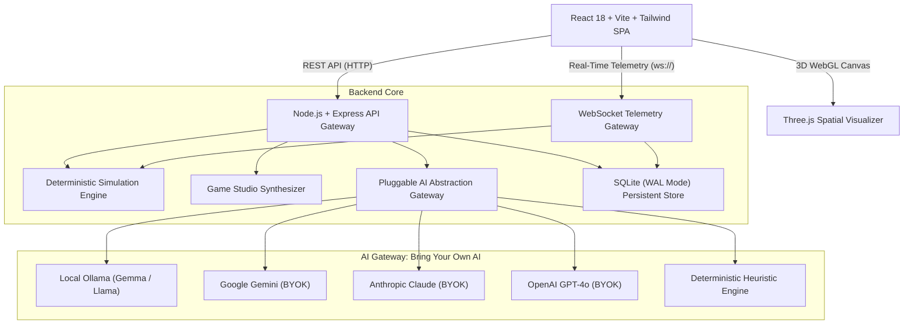

# 💎 GemSim: Enterprise Architecture & Business Strategy Simulation Platform

> **Production-Grade SaaS Platform for Competitive Business Strategy, Enterprise Architecture, and Operations Simulations**

[](https://podman.io/)
[](https://www.typescriptlang.org/)
[](https://react.dev/)
[](https://threejs.org/)
[](#1-pluggable-ai-abstraction-layer-bring-your-own-ai)

---

## 🌟 Executive Overview

**GemSim** puts cross-functional corporate teams at the helm of realistic, high-stakes multi-round enterprise scenarios. Facing legacy technical debt, aggressive market challengers, regulatory audits, and budget constraints, teams must balance rapid feature velocity against architectural resilience across discrete execution cycles (Quarters).

The platform features:
- **Interactive 3D Spatial Enterprise Journey**: 4-layer 3D topology canvas (Business, Application, Data, Infrastructure) with live particle telemetry, latency bottlenecks, and health degradation.
- **Autonomous AI Stakeholders**: Executive personas (CFO, VP Product, Chief Enterprise Architect, Compliance Officer) with dynamic trust scoring, hidden agendas, and live proposal negotiations.
- **AI-Powered Game Studio**: Plain-text generative scenario authoring module capable of synthesizing validated arenas, stakeholders, topology graphs, and round timelines on demand.
- **Facilitator War Room Cockpit**: Real-time telemetry monitoring all competing teams, master timer controls, black swan crisis injection, and post-simulation debriefing radar scorecards.
- **Pluggable AI Abstraction Layer ("Bring Your Own AI")**: Seamless runtime switching between Local Ollama (Gemma 4/2), Google Gemini, Anthropic Claude, OpenAI, and a zero-dependency heuristic fallback engine.
- **Rootless Podman Containerization**: Fully unprivileged multi-container compose architecture running under UID `10001`.

---

## 🏗️ System Architecture & Decoupled Components



### Decoupled Subsystems

1. **Simulation Calculation Engine (`server/src/engine/`)**:
   - Turn-based deterministic state machine calculating Technical Debt Index (TDI) compounding, non-linear velocity drag, OpEx multipliers, incident probabilities, and stakeholder trust deltas.
2. **Pluggable AI Gateway (`server/src/ai/`)**:
   - Strategy/Adapter pattern with unified interfaces for structured JSON generation, streaming dialogues, and proposal evaluations.
   - Built-in automatic fallback cascade ensuring 100% operational resilience.
3. **AI Game Studio (`server/src/ai/studio-generator.ts`)**:
   - Synthesizes validated, playable scenario schemas from natural language prompts.
4. **Interactive 3D Topology Canvas (`client/src/components/3d/`)**:
   - High-performance Three.js spatial graph with raycast node inspection, isometric layering, and animated particle data pipelines.
5. **Facilitator Telemetry Cockpit (`client/src/components/warroom/`)**:
   - Multi-team synchronization, timer controls, live event injection, and exportable post-simulation radar rankings.

---

## 🧮 Mathematical Scoring Formulas

### 1. Technical Debt Compounding Rate ($TDI_t$)
Technical debt compounds like financial debt with variable interest determined by team governance:

$$\Delta TDI_{\text{compound}} = TDI_{t-1} \times r_{\text{compound}}$$

| Governance Posture | Compound Rate ($r$) | Strategy Description |
| :--- | :---: | :--- |
| **Bypass Architecture** | **18.0%** | Feature fast-track; immediate velocity sugar-rush; catastrophic debt accumulation. |
| **Balanced Agile** | **8.0%** | Standard continuous delivery with moderate architectural hygiene. |
| **Accelerated Modernization** | **4.0%** | Dedicated 35% engineering capacity to refactoring and strangler migrations. |
| **Strict Architecture Review** | **2.5%** | Mandatory review board gates; maximum debt containment; audit ready. |

$$TDI_t = \text{clamp}\Big(TDI_{t-1} + \Delta TDI_{\text{compound}} + \sum \Delta TDI_{\text{initiatives}} + \Delta TDI_{\text{event}}, 5, 100\Big)$$

### 2. Delivery Velocity Drag Curve ($V_t$)
High technical debt imposes exponential drag on development teams as engineers spend increasing time fighting outages and patching brittle monoliths:

$$\text{Drag Percentage} = 70\% \times \left(\frac{TDI_t}{100}\right)^{1.4}$$

$$V_{\text{effective}} = \text{clamp}\Big(V_{\text{base}} \times (1 - \text{Drag\\%}) + \sum V_{\text{bonuses}}, 8, 100\Big)$$

*Example: At TDI = 80%, velocity drag reaches 51.5%, slashing a 65-point base velocity down to 31.5 points!*

### 3. Operating Expenditure (OpEx) Run-Rate
Maintenance overhead escalates non-linearly with technical debt:

$$\text{OpEx}_t = \sum_{n \in \text{Nodes}} \text{Cost}(n) \times \left(1 + 0.45 \times \frac{TDI_t}{100}\right) + \Delta \text{OpEx}_{\text{initiatives}}$$

### 4. Node Failure Risk & Production Outages
Each node's failure probability is modeled as:

$$P(\text{Fail}) = \left(\frac{\text{Node TDI}}{100}\right)^{2.2} \times (\text{isCritical} ? 1.6 : 0.9) \times \left(1 - \frac{\text{ResilienceIndex}}{160}\right)$$

When $P(\text{Fail}) > 0.45$, production outages trigger emergency recovery expenses ($$75K - $$350K), temporary velocity penalties, and customer churn.

### 5. Stakeholder Sentiment Function
Executive trust updates dynamically using weighted vector evaluation:

$$\Delta \text{Trust}_i = \text{clamp}\Big(15 \times \sum (w_{i, k} \times \Delta_k), -25, +25\Big)$$

---

## 🤖 Pluggable AI Abstraction Layer ("Bring Your Own AI")

GemSim provides a unified interface across all major LLM providers:

```typescript
export interface AIProvider {
  checkHealth(): Promise<{ ok: boolean; message: string; latencyMs: number }>;
  generateText(messages: AIMessage[], options?: AIGenerateOptions): Promise<string>;
  generateJSON<T>(messages: AIMessage[], options?: AIGenerateOptions): Promise<T>;
  generateStream(messages: AIMessage[], onChunk: (chunk: string) => void, options?: AIGenerateOptions): Promise<string>;
  evaluateStakeholderProposal(context: StakeholderNegotiationContext): Promise<{ responseDialogue: string; evaluation: ProposalEvaluation }>;
  generateScenario(prompt: ScenarioGenerationPrompt): Promise<Partial<Scenario>>;
}
```

### Supported Providers

1. **Local Ollama (Gemma 4 / Gemma 2)**:
   - Configurable via `OLLAMA_BASE_URL` (default `http://gemsim-ollama:11434` or `http://localhost:11434`).
   - Zero external telemetry, runs completely air-gapped within Podman.
2. **Google Gemini (BYOK)**:
   - Official REST API integration supporting `gemini-1.5-flash` and `gemini-1.5-pro`.
   - Structured JSON mode and high-speed streaming.
3. **Anthropic Claude (BYOK)**:
   - Anthropic messages API supporting `claude-3-5-sonnet-20241022`.
4. **OpenAI (BYOK)**:
   - JSON-object structured outputs supporting `gpt-4o` and `gpt-4o-mini`.
5. **Deterministic Heuristic Engine (Offline Zero-Dependency Fallback)**:
   - Built-in heuristic engine providing coherent, roleplay-accurate dialogues and scenario schemas without external keys or downloads.

---

## 🐳 Podman Rootless Deployment Guide

GemSim is purpose-built for rootless, unprivileged container execution adhering to enterprise security standards.

### Security Specifications
- **Unprivileged Non-Root Execution**: Runs under UID `10001` (`gemsim:gemsim`).
- **SELinux Volume Labels**: Persistent storage mapped with `:Z` flag for rootless Podman.
- **Port Mapping**: Container port 8089 exposed to host port 8089.

### Quick Start with Podman Compose

```bash
# 1. Clone repository and navigate to root
cd /path/to/gemsim

# 2. Copy environment configuration
cp .env.example .env

# 3. Build and launch with Podman Compose
podman-compose up -d --build

# 4. Check container health
podman-compose ps

# 5. Access the SaaS application
open http://localhost:8089
```

### Running with Dedicated Local Gemma Container

The `podman-compose.yml` includes a local Ollama container:

```bash
# 1. Start both the app and Ollama service
podman-compose up -d

# 2. Pull lightweight Gemma model into the local container volume
podman exec -it gemsim-ollama ollama pull gemma:2b

# 3. In the GemSim Web UI:
# Navigate to Settings (Gear icon) -> Select "Ollama" -> Click "Test Ping" -> Apply Configuration.
```

---

## 🎮 Online Interactive User Journeys

### 1. Player Journey (Cross-Functional Squad)
1. **Analyze Topology**: Open the **3D Spatial Enterprise Canvas** to inspect application nodes, dependencies, and high-debt bottlenecks.
2. **Negotiate with Stakeholders**: Enter the **AI Stakeholder War Room** to propose compromises to the CFO, VP Product, and Chief Architect.
3. **Allocate Portfolio**: Select strategic modernization initiatives (Strangler Fig, Kafka Streaming, Cloud Mesh, Zero-Trust).
4. **Set Governance**: Pick a governance posture (Bypass, Balanced, Strict, Modernize) and address the quarterly crisis.
5. **Submit & Review**: Lock turn decisions and review quarterly outcomes, incident logs, and compounding drift.

### 2. Facilitator Journey (War Room Cockpit)
1. **Launch Session**: Create a simulation session selecting any scenario and setting competing team count (1-5 teams).
2. **Live Telemetry**: Monitor team metrics side-by-side in real time via WebSockets.
3. **Control Flow**: Play/pause round timers, send broadcast announcements, and advance rounds with one click.
4. **Inject Crises**: Trigger black-swan events (Zero-Day Exploit, Cloud Outage) on the fly.
5. **Executive Debrief**: Review comparative radar charts, determine the winning strategy, and export executive JSON/Markdown reports.

### 3. Game Studio Authoring Journey (Scenario Designer)
1. **Generative Prompt**: Enter an industry vertical and business challenge in plain text.
2. **One-Click Synthesis**: The AI Gateway generates a validated multi-tier scenario schema.
3. **Inspect & Tweak**: Preview the 3D topology graph, adjust stakeholder personas, and edit round timelines.
4. **Publish**: Save directly into the game library for immediate multiplayer play.

---

## 🧪 Testing & Verification

GemSim includes automated unit test suites covering the mathematical formulation, turn resolution state machine, and fallback AI provider:

```bash
# Run test suite
npm test
```

Test Results:
```
 ✓ server/test/math.test.ts (7 tests) 2ms
   ✓ Compounds technical debt drastically faster when bypassing architecture
   ✓ Imposes non-linear delivery velocity drag as technical debt climbs
   ✓ Calculates OpEx factoring in node upkeep and debt penalty
   ✓ Evaluates stakeholder sentiment according to executive role weights
   ✓ Resolves a round deterministically and updates metrics, history, and debt
   ✓ Generates a full validated scenario from plain text prompt
   ✓ Evaluates stakeholder negotiations with responsive score and dialogue

 Test Files  1 passed (1)
      Tests  7 passed (7)
```

---

## 📜 License
Apache-2.0. Developed for Enterprise Strategic Architecture & Operations Simulations.
