# 💎 GemSim: Enterprise Architecture & Business Strategy Simulation Platform

> **Production-Grade SaaS Platform for Competitive Business Strategy, Enterprise Architecture, and Operations Simulations**

[](https://podman.io/)
[](https://www.typescriptlang.org/)
[](https://react.dev/)
[](https://threejs.org/)
[](#1-pluggable-ai-abstraction-layer-bring-your-own-ai)

---

## 🌟 Executive Overview

**GemSim** puts cross-functional corporate teams at the helm of realistic, high-stakes multi-round enterprise scenarios. Facing legacy technical debt, aggressive market challengers, regulatory audits, and budget constraints, teams must balance rapid feature velocity against architectural resilience across discrete execution cycles (Quarters).

The platform features:
- **Interactive 3D Spatial Enterprise Journey**: 4-layer 3D topology canvas (Business, Application, Data, Infrastructure) with live particle telemetry, latency bottlenecks, and health degradation.
- **Autonomous AI Stakeholders**: Executive personas (CFO, VP Product, Chief Enterprise Architect, Compliance Officer) with dynamic trust scoring, hidden agendas, and live proposal negotiations.
- **AI-Powered Game Studio**: Plain-text generative scenario authoring module capable of synthesizing validated arenas, stakeholders, topology graphs, and round timelines on demand.
- **Facilitator War Room Cockpit**: Real-time telemetry monitoring all competing teams, master timer controls, black swan crisis injection, and post-simulation debriefing radar scorecards.
- **Pluggable AI Abstraction Layer ("Bring Your Own AI")**: Seamless runtime switching between Local Ollama (Gemma 4/2), Google Gemini, Anthropic Claude, OpenAI, and a zero-dependency heuristic fallback engine.
- **Hybrid System 1 / System 2 Decisions**: A non-autoregressive decision model (Clef-flash, Jev-compatible) decides stakeholder verdicts, trust shifts and board votes as calibrated probabilities; the LLM only writes the dialogue.
- **Competitive market & P&L**: teams sell into the same customer segments, against each other and scripted rivals. Customers choose on price, quality, capacity, reliability and marketing, so debt, resilience and compliance become measurable competitive advantages. Revenue, margin, market share and cumulative profit feed the verdict.
- **AI-era learning loop**: a coach explains every quarter from the engine's own breakdown (the LLM only rephrases it), a "what if" replay changes one past decision and replays the whole game exactly, an automatic debrief gives the facilitator each team's decisive quarters and the questions to ask, and executives remember the promises a team kept or broke.
- **Any business case, not only IT**: each scenario declares a domain (IT, industrial, market expansion, sourcing/offshore, generic) and its own vocabulary, so a plant acquisition talks about *asset ageing* and *production capacity* while the engine stays the same.
- **Learning by design**: FR/EN interface, glossary and contextual tooltips, a guided tutorial with a practice game, a commented demo, and a facilitator kit (learning objectives, agenda, debrief guide, assessment rubric, pilot protocol).
- **Rootless Podman Containerization**: Fully unprivileged multi-container compose architecture running under UID `10001`.

---

## 🎬 Live Simulation Showcase: HealthNova EHR & Telehealth Overhaul

> *Featured Scenario:* **HealthNova: Clinical EHR & Telehealth Overhaul**  
> *Sector:* HealthTech & Hospital Network Operations | *Target:* 4-Quarter Turnaround  
> *The Burning Platform:* 15 regional hospitals facing an Epic/Cerner legacy monolith lock-in, 68% Technical Debt Index, and critical latency bottlenecks during peak telehealth video consultations.

<p align="center">
  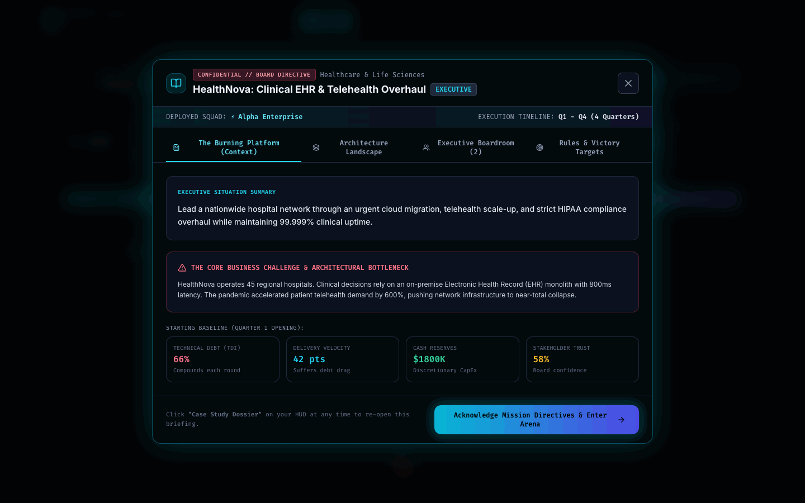
</p>

### 1. 🌌 3D Spatial Enterprise Architecture & Real-Time Telemetry
GemSim visualizes complex multi-tier enterprise systems in real-time WebGL space using advanced architectural metaphors: **multi-story glass slabs**, **fluted wireframe database barrels**, **translucent plinths**, and **floating 3D text billboards**.

| 🏛️ 3D Spatial Enterprise Architecture | 🛰️ 3D Canvas & Node HUD |
| :---: | :---: |
| 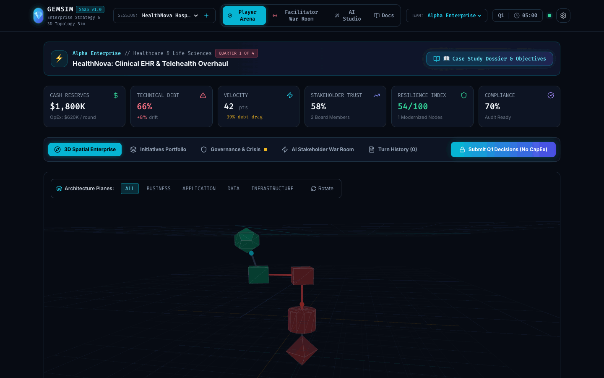 | 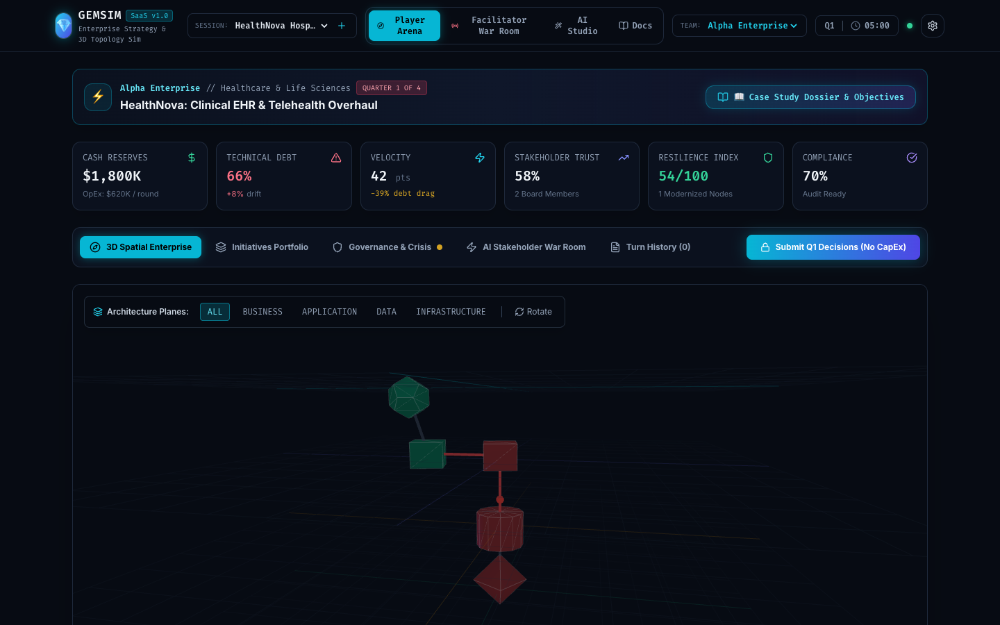 |
| *Continuous 3D orbit around enterprise topology with architectural stacks and data cylinders* | *Interactive 3D canvas featuring node status indicators, ground pedestals, and Live Enterprise Model HUD* |

- **Architectural Stack Metaphor**: Systems are rendered as multi-story glass buildings and fluted wireframe data cylinders representing databases and core microservices.
- **Floating 3D Text Billboards**: High-contrast, always-facing text labels hovering directly above every building for effortless architectural readability without hovering.
- **Ground Pedestals & Halo Rings**: Glass plinths anchor each component onto the perspective grid, with luminous halo rings delineating critical data repositories.
- **Curved Particle Telemetry**: Bezier-curved conduits channel dynamic data flow particles with color-graded latency and bottleneck indicators.

---

### 2. 🤖 Autonomous AI Stakeholder War Room (Live Dynamic Negotiation)
Interact with autonomous C-suite executive personas driven by local or cloud LLMs. Stakeholders evaluate trade-offs, enforce hidden agendas, and adjust trust scores in real time based on semantic proposal analysis.

<p align="center">
  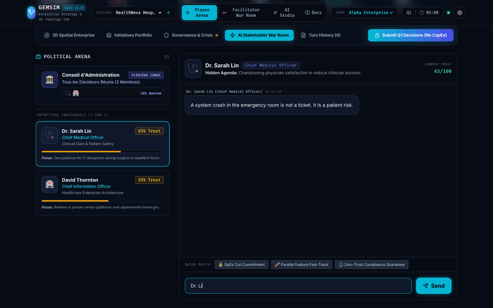
</p>

| Stakeholder AI Persona Hub | Real-Time Streaming Evaluation Dialogue |
| :---: | :---: |
| 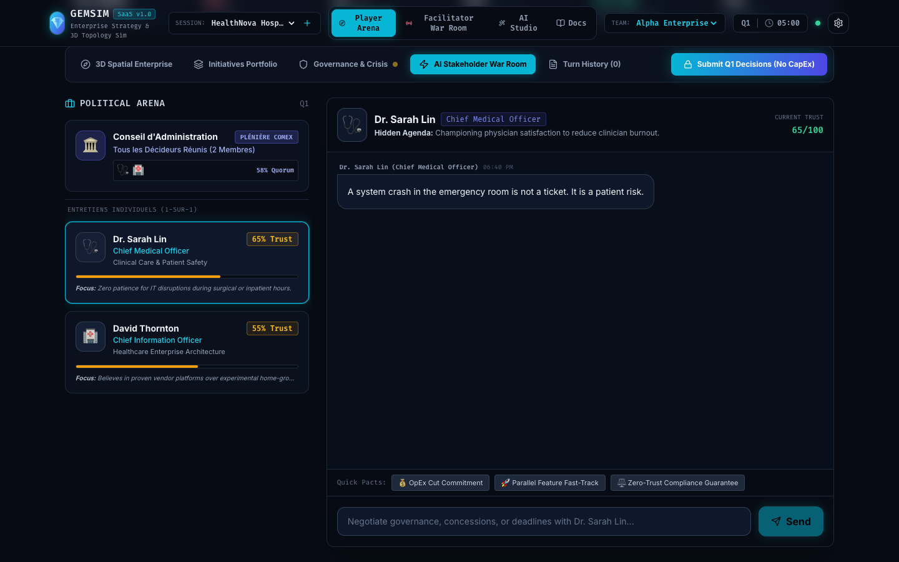 | *Dr. Sarah Lin (Chief Medical Officer) dynamically evaluates our FHIR migration proposal, noting clinical stability and awarding +4 Trust points.* |

- **Persona Depth**: **Dr. Sarah Lin (CMO)** prioritizes zero clinician disruption; **David Thornton (CIO)** balances legacy mainframe stability with cloud agility; **Victoria Sterling (CFO)** enforces budget runways.
- **Anti-Cheat Semantic Scoring**: AI stakeholders detect repetitive copy-paste arguments, superficial buzzwords, and budget shortfalls, requiring genuine architectural trade-offs.
- **Patience Meters**: Each executive has a per-quarter patience gauge. Empty pitches (-30), repeats (-35), rejections (-20) and conditional answers (-8) drain it; acceptances restore it (+5). At 0 the executive closes the door until next quarter and votes against in the boardroom. Patience recovers by 50 each quarter.
- **Binding Pacts**: When an executive demands a concession, the player can sign it as a pact with a committed budget. Pacts share the quarter's budget envelope and are honored at resolution (cost charged, trust +5 to +15).
- **Boardroom Debates**: After the vote, the most opposed member rebuts the most supportive one in character.
- **1-on-1 vs Board**: 1-on-1s cost full patience, move one executive's trust and allow pacts; the board judges everyone at once (half patience each), runs a debate and votes. Its resolution becomes the quarter's **board mandate** (extra capacity and velocity when approved, risk restrictions when not). Lobby individually, then convene the board.
- **System One Verdicts**: When a System One model is available, verdicts, trust deltas and scores come from typed judgments (with per-verdict probabilities) instead of LLM-generated JSON. See [System One Decision Layer](#-system-one-decision-layer-clef--jev).

---

### 3. 📊 Executive Briefing & Strategic Decision Cockpit
Teams navigate strategic dilemmas across discrete quarterly cycles, balancing modernization investments against urgent operational shocks.

| 📋 Executive Case Briefing | 🛠️ Strategic Modernization Initiatives | ⚖️ Governance & Disruption Shocks |
| :---: | :---: | :---: |
| 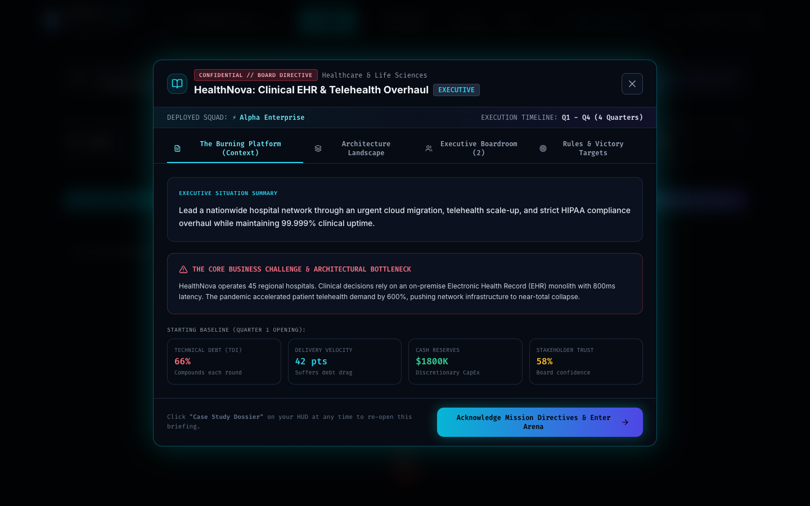 | 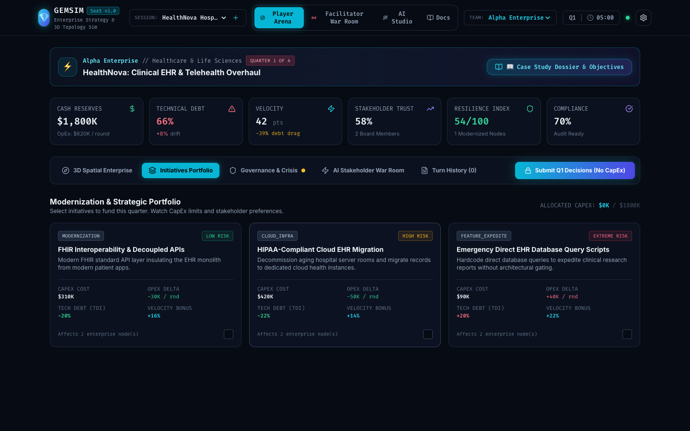 | 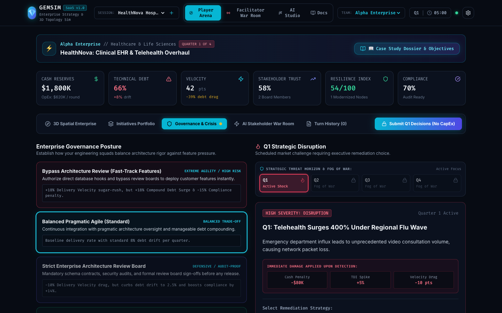 |
| *Case briefing with baseline metrics, regulatory mandates, and financial runway.* | *Portfolio decisions: FHIR Integration Layer vs Direct DB Emergency Scripts.* | *Governance posture selection and Q1 Telehealth Consultation Surge shock.* |

- **Executive Briefing Dossier**: Comprehensive problem statement, risk factors, and success criteria displayed upon entering the arena.
- **Modernization Trade-offs**: Choose between high-integrity long-term investments (Strangler Fig pattern, Cloud EHR) or quick high-debt hacks (direct database writes).
- **Governance Postures**: Enforce *Strict Architecture Review* to suppress technical debt compounding or *Bypass Architecture* for temporary velocity boosts.
- **Fog of War Roadmaps**: Progressive quarterly disclosure of unexpected market and operational disruptions.

---

### 4. 🛠️ AI Scenario Studio (Generative Authoring & 3D Synthesis)
Design, synthesize, and validate playable enterprise simulations from plain-text natural language prompts in seconds using local or cloud AI models.

<p align="center">
  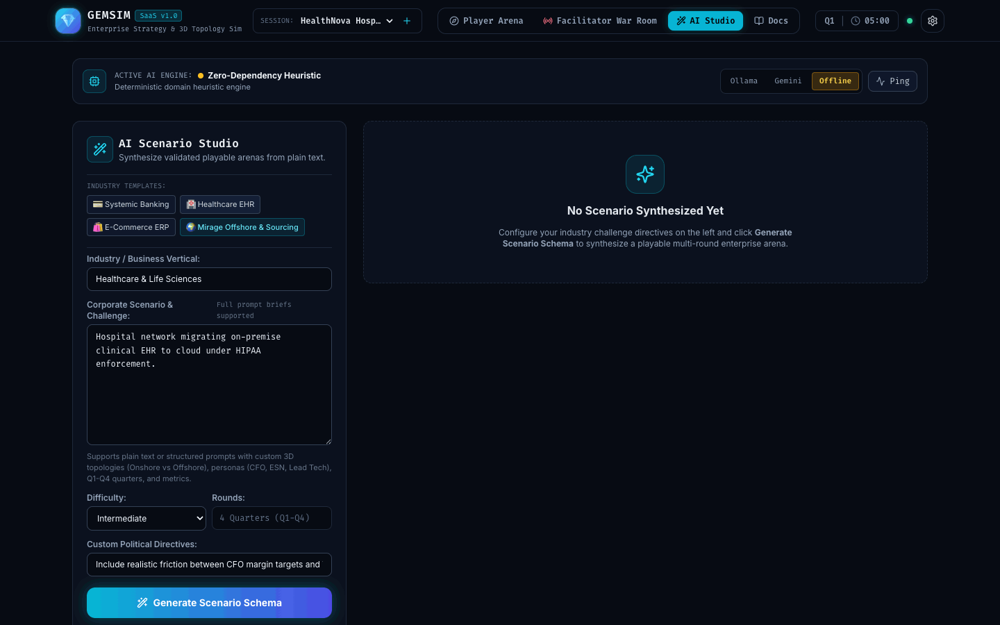
</p>

| 3D Topology Preview & Synthesis | 👥 C-Suite Personas & Agendas | 📅 4-Quarter Timeline & Fog of War |
| :---: | :---: | :---: |
| 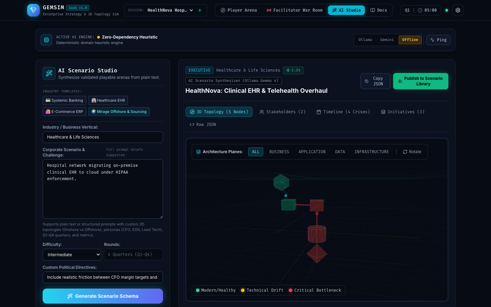 | 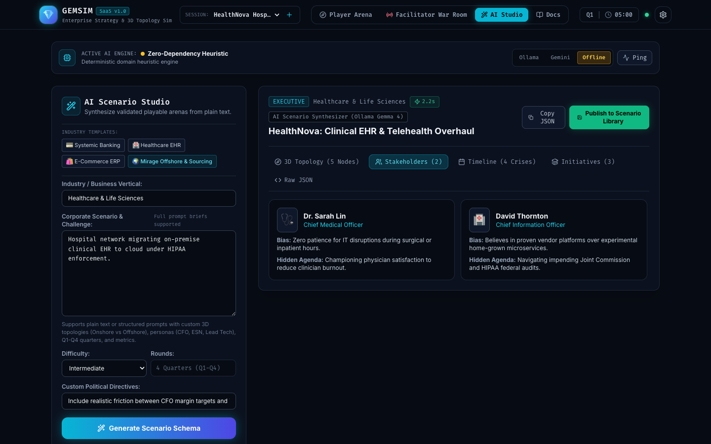 | 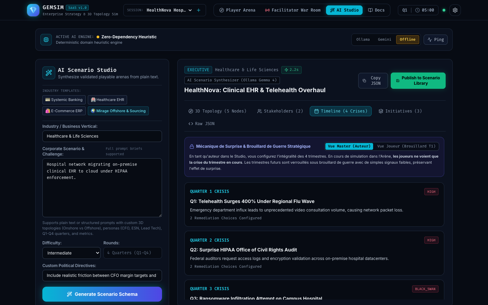 |
| *Interactive 3D WebGL preview of generated architecture nodes and layer planes.* | *Psychological profiling, cognitive biases, and hidden agendas (Dr. Sarah Lin & David Thornton).* | *Strategic evolution across Q1-Q4 with Author View vs Player Fog of War toggles.* |

- **Natural Language Synthesis**: Enter industry briefs or complex multi-paragraph corporate cases (Healthcare EHR, Core Banking Modernization, Mirage Offshore Sourcing).
- **5-Phase Generation Pipeline**: Progressive real-time compilation from topology graph and competing stakeholder dialectics to crisis roadmaps and mathematical constraint validation.
- **Live Streaming & Balance Report**: The Studio streams the model's JSON as it is written, then runs the balance check (best achievable verdict and bot results) on the generated scenario before you publish.
- **Active AI Engine Diagnostics**: Switch seamlessly at runtime between Local Ollama (`gemma4:12b`), Google Gemini, Claude, OpenAI, or the offline zero-dependency heuristic engine with live latency monitoring.
- **One-Click Publishing**: Instant export and activation directly into the multiplayer simulation library.

---

### 5. 🕹️ Facilitator Master Operations War Room
Empower workshop facilitators, enterprise architects, and executive trainers with a unified mission control cockpit to orchestrate multi-team competitive simulations in real time.

<p align="center">
  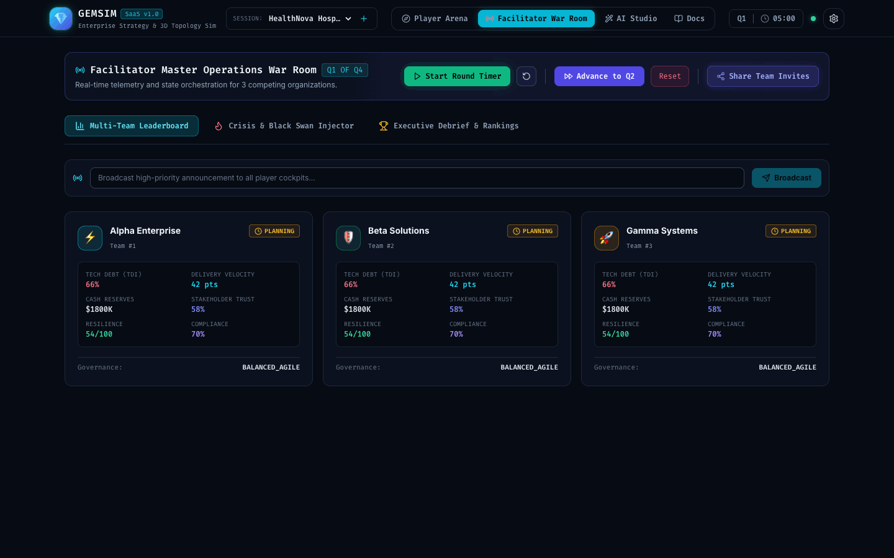
</p>

| 📊 Multi-Team Telemetry Leaderboard | ⚡ Live Crisis & Black Swan Injector | 🔗 Workshop Invites & Role Isolation |
| :---: | :---: | :---: |
| 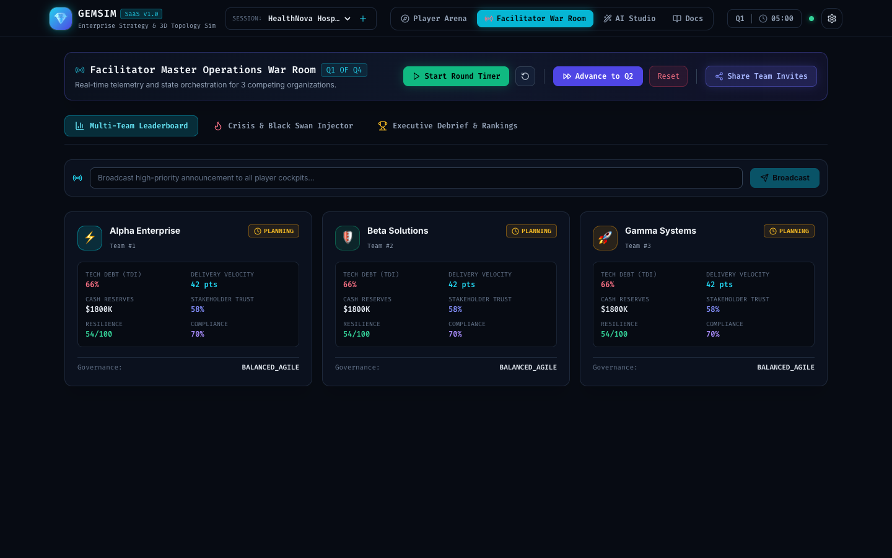 | 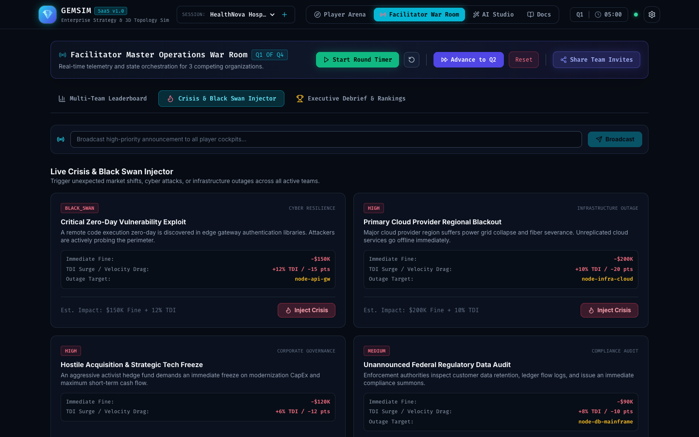 | 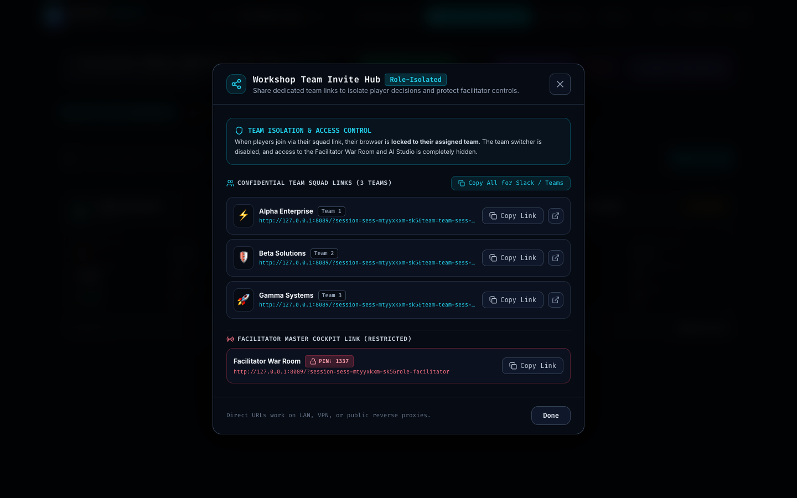 |
| *Side-by-side real-time tracking of Alpha, Beta, and Gamma squads (TDI, Velocity, OpEx, Trust).* | *Trigger on-demand systemic shocks (Zero-Day Exploits, Cloud Blackouts, Regulatory Audits).* | *Role-isolated squad join links with strict browser sandboxing and facilitator PIN security.* |

- **Master Simulation Controls**: Synchronized countdown timer, Play/Pause, round advance triggers (Q1 to Q4), and real-time broadcast emergency alerts.
- **Live Crisis & Black Swan Injection**: Test team resilience by triggering unexpected operational emergencies on the fly, forcing squads to adapt their quarterly roadmaps.
- **Role Isolation & Security**: Player squads receive dedicated links restricting access strictly to their arena, protecting facilitator controls and the AI Studio behind PIN authentication.
- **Executive Post-Mortem Debriefing**: Automated comparative radar charts, performance rankings, and exportable executive JSON/Markdown reports at session conclusion.

---

## 🏗️ System Architecture & Decoupled Components

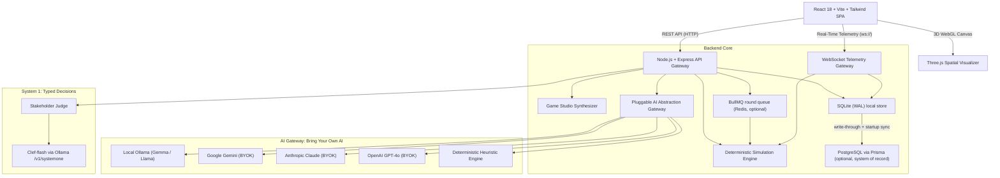
```mermaid
graph TD
    Client["React 18 + Vite + Tailwind SPA"] -->|"REST API (HTTP)"| Server["Node.js + Express API Gateway"]
    Client -->|"Real-Time Telemetry (ws://)"| WSServer["WebSocket Telemetry Gateway"]
    Client -->|"3D WebGL Canvas"| ThreeEngine["Three.js Spatial Visualizer"]

    subgraph BackendCore["Backend Core"]
        Server --> Engine["Deterministic Simulation Engine"]
        Server --> Studio["Game Studio Synthesizer"]
        Server --> AIRegistry["Pluggable AI Abstraction Gateway"]
        Server --> DB["SQLite (WAL) local store"]
        Server --> Queue["BullMQ round queue (Redis, optional)"]
        Queue --> Engine
        DB -->|"write-through + startup sync"| PG["PostgreSQL via Prisma (optional, system of record)"]
        WSServer --> Engine
        WSServer --> DB
    end

    subgraph AIGateway["AI Gateway: Bring Your Own AI"]
        AIRegistry --> Ollama["Local Ollama (Gemma / Llama)"]
        AIRegistry --> Gemini["Google Gemini (BYOK)"]
        AIRegistry --> Claude["Anthropic Claude (BYOK)"]
        AIRegistry --> OpenAI["OpenAI GPT-4o (BYOK)"]
        AIRegistry --> Fallback["Deterministic Heuristic Engine"]
    end

    subgraph SystemOne["System 1: Typed Decisions"]
        Server --> Judge["Stakeholder Judge"]
        Judge --> Clef["Clef-flash via Ollama /v1/systemone"]
    end
```

### Decoupled Subsystems

1. **Simulation Calculation Engine (`server/src/engine/`)**:
   - Turn-based deterministic state machine calculating Technical Debt Index (TDI) compounding, non-linear velocity drag, OpEx multipliers, incident probabilities, and stakeholder trust deltas.
2. **Pluggable AI Gateway (`server/src/ai/`)**:
   - Strategy/Adapter pattern with unified interfaces for structured JSON generation, streaming dialogues, and proposal evaluations.
   - Built-in automatic fallback cascade ensuring 100% operational resilience.
3. **System One Decision Layer (`server/src/ai/systemone.ts`, `server/src/ai/stakeholder-judge.ts`)**:
   - Typed `noul` / `choice` / `score` judgments from a non-autoregressive model; decides negotiation outcomes before the LLM writes dialogue.
4. **AI Game Studio (`server/src/ai/studio-generator.ts`)**:
   - Synthesizes validated, playable scenario schemas from natural language prompts.
5. **Interactive 3D Topology Canvas (`client/src/components/3d/`)**:
   - High-performance Three.js spatial graph with raycast node inspection, isometric layering, and animated particle data pipelines.
6. **Facilitator Telemetry Cockpit (`client/src/components/warroom/`)**:
   - Multi-team synchronization, timer controls, live event injection, comparative radar chart, rankings by win-condition score, and JSON / Markdown debrief exports.
7. **Client State (`client/src/stores/useSimulationStore.ts`)**:
   - Zustand store holding scenarios, sessions, the active session and team, and applying every WebSocket server message.
8. **Request Validation (`server/src/validation.ts`)**:
   - Zod schemas on every mutating endpoint (sessions, decisions, pacts, crisis injection, broadcasts, negotiation, boardroom, studio generation); invalid payloads get HTTP 400 with the issues.

---

## 🎯 Game Rules: Budget, Capacity, Win & Loss

Each quarter's choices are checked by the same pure rule function on the server (`server/src/engine/rules.ts`) and in the UI (`client/src/engine.ts` re-exports it), so the UI shows exactly what the server will accept.

| Rule | Effect |
| :--- | :--- |
| **Budget envelope** | CapEx of started initiatives + crisis response cost + pacts must fit in the cash available. A submission over budget is rejected (HTTP 422). |
| **Delivery capacity** | At most `maxInitiativesPerRound` initiatives per quarter (default 2). |
| **One-time initiatives** | A completed or in-progress initiative cannot be bought again. |
| **Multi-quarter delivery** | CapEx is paid when an initiative starts; its effects land when it completes (`durationRounds`). |
| **Run vs change budget** | The business funds a quarterly run budget equal to the starting estate's OpEx. OpEx above it is charged to the change budget; half of any savings is returned. |
| **Persistent capabilities** | Half of a completed initiative's velocity gain persists in later quarters; OpEx deltas are permanent run-rate changes. |
| **Regulatory fines** | Compliance under 50% costs $6K per point below the threshold, and compliance-minded executives lose trust. |
| **Insolvency** | Negative cash costs every executive trust (weighted by financial focus). The team can still submit an empty quarter. |
| **Incidents** | At-risk nodes (P(Fail) > 0.45) fail on a seeded roll against P(Fail): reproducible per session/team/quarter, not deterministic. Each incident also costs velocity. |
| **Board mandate** | The latest board resolution of the quarter shapes it: **APPROVED** = +1 initiative capacity and +5 velocity at resolution; **CONDITIONAL QUORUM** = EXTREME-risk initiatives blocked; **REJECTED** = -1 capacity (min 1) and HIGH/EXTREME-risk initiatives blocked. No board meeting = no effect. |
| **Market (optional)** | Prices must stay within 50–200% of the segment's reference price; marketing and new-market entries count in the budget envelope; marketing only where the team sells. |
| **Crisis injection** | An injected crisis hits immediately and is not charged again at resolution; teams that answered the old dilemma must choose again. |

| Budget, capacity, multi-quarter delivery & pacts | Patience meters & binding pacts |
| :---: | :---: |
| 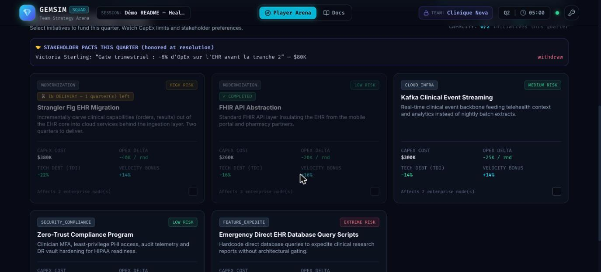 | 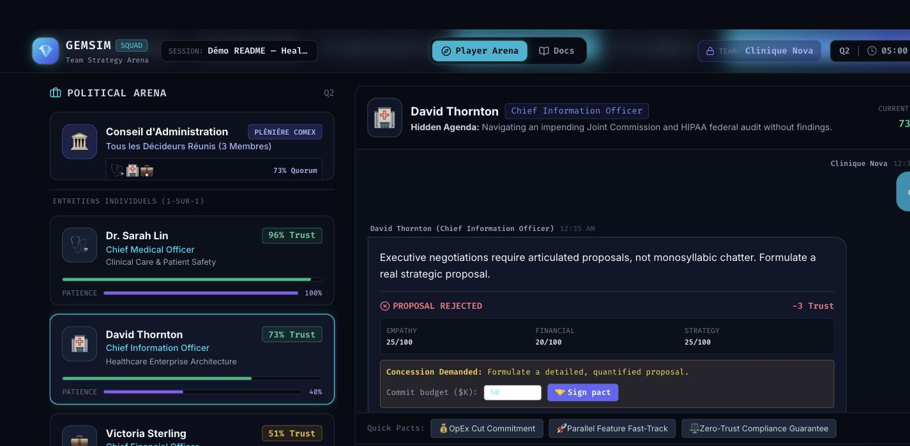 |

### Win / loss evaluation (`server/src/engine/outcome.ts`)

After the final quarter every team gets a verdict against the scenario's `winLossConditions`, plus solvency:

| Verdict | Condition |
| :--- | :--- |
| **VICTORY** (A+/A) | Every objective met: TDI, trust, velocity, resilience, TCO, capabilities modernized, cash ≥ 0, plus market share and cumulative profit in market scenarios (7 or 9 objectives). |
| **PARTIAL** (B/C) | Solvent and at least half of the objectives met (4 of 7, 5 of 9). |
| **DEFEAT** (D/F) | Otherwise. |

The score (0–100) is 90 points for reaching the targets (partial credit by distance) plus 10 for the headroom beyond them: a narrow win is an A, a dominant one an A+. It ranks teams in the facilitator debrief. Players see a live objectives tracker each quarter and a final verdict screen at the end. A node counts as a modernized capability when a completed modernization initiative brings its debt to 50 or below.

| Final verdict (player) | Debrief: radar & rankings (facilitator) |
| :---: | :---: |
| 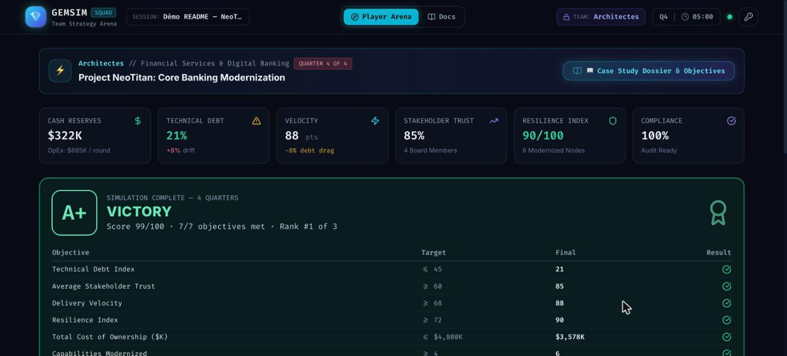 | 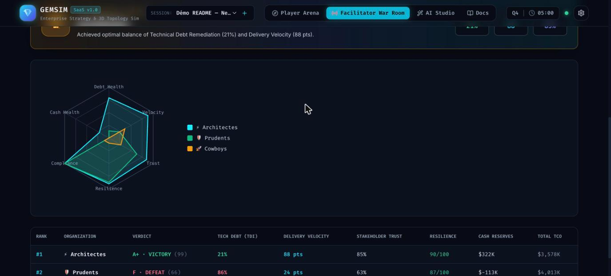 |

**Tension mechanics:** shipping creates debt (+1 TDI per 10 velocity points per quarter), resilience erodes by 4 per quarter, only 60% of an initiative's announced debt reduction is realized, and returns diminish as debt gets low or resilience gets high.

### Balance & playability check (`server/src/engine/balance.ts`)

Three bots play every quarter through the real resolver, and a beam search explores legal decision paths to find the best achievable outcome:

| Scenario | Best path found | Architect bot | Prudent bot | Cowboy bot |
| :--- | :--- | :--- | :--- | :--- |
| NeoTitan (Intermediate) | VICTORY A+ | VICTORY A+ | PARTIAL C | DEFEAT F |
| HealthNova (Executive) | VICTORY A+ | PARTIAL B | PARTIAL B | DEFEAT F |
| Mirage Offshore (Executive) | VICTORY A+ | VICTORY A+ | PARTIAL C | DEFEAT F |
| Vénissieux plant acquisition (Executive, industrial, market) | VICTORY A+ | PARTIAL B | DEFEAT D | DEFEAT F |
| Maison Dumas expansion (Executive, market) | VICTORY A+ | PARTIAL B | DEFEAT F | DEFEAT F |

In market scenarios the three bots also play a **tournament** in one shared market (architect at reference prices with brand investment, prudent at a premium without marketing, cowboy buying share with low prices): in both market scenarios the architect wins (VICTORY A+) while the price war ends in DEFEAT F. Bots and beam search resolve against the scripted rivals.

A test fails if any seeded scenario becomes unwinnable or lets the bypass strategy win. The Studio runs the same check on every generated scenario and shows the report before publishing.

### Solo play

When a session has a single team, the player can resolve the quarter from the arena after submitting; no facilitator PIN is needed.

---

## 📈 Competitive Market & P&L (`server/src/engine/market.ts`)

A scenario may declare a `market`: customer segments (demand, growth, reference price, purchase criteria, some closed until the team pays an entry fee), scripted rivals (price index, quality, aggressiveness) and the business economics (unit cost, fixed costs, units per capacity point, share of the result credited to the program).

| Mechanism | Rule |
| :--- | :--- |
| **Customer choice** | Multinomial logit. Attractiveness = exp(price + quality + availability + reliability + marketing terms); price uses log(price / reference), quality blends low debt and compliance, availability is delivery capacity, reliability is resilience, marketing has diminishing returns. |
| **Shared market** | All teams of a session and the rivals split each segment by attractiveness. Market size scales with the number of teams (per segment, by its rival count) so each team faces the same opportunity as a solo player. |
| **Capacity** | Sales are capped by delivery capacity × units per point; unserved demand goes to the sellers that can still deliver. |
| **Timing** | The market clears at the start of the quarter on the capabilities each team brings into it: investments sell from the next quarter. A seeded ±5% demand shock applies per segment. |
| **P&L** | Operating profit = revenue − variable costs − fixed costs − run cost (OpEx) − marketing. The program cash receives `cashRetention` × (margin − fixed costs − run budget − marketing), minus entry fees. Finance-minded executives read the margin. |
| **Objectives** | `minMarketShare` (scaled to the number of teams) and `minCumulativeProfit` join the verdict. |
| **Secrecy** | Players never receive other teams' pending decisions (REST and WebSocket player views); the facilitator with the PIN sees everything. |

The player's **Market** tab sets prices, marketing and entries per segment and projects demand, share, capacity use, the drivers of customer choice and the P&L with the same clearing function as the server (other teams at last quarter's public prices). The history shows each quarter's P&L, the cockpit adds market columns, a market radar axis and a share/profit-by-quarter table for the debrief. The Studio can generate a market (*Competitive market* checkbox): numbers are bounded and calibrated (fixed costs so the starting company breaks even, objectives derived from the starting position), and the balance report includes the tournament.

## 🧭 Coach, "What If" Replay, Automatic Debrief & Promise Memory

| Feature | How it works | Where |
| :--- | :--- | :--- |
| **Quarter breakdown** | The resolver records where each change came from: debt (interest, initiatives, posture, delivery, crisis), capacity (debt drag, capabilities, initiatives, board, posture, crisis, incidents) and cash (investments, crisis, incidents, fines, pacts, run overrun, market). It also keeps the decision, the board mandate, trust before/after and market presence. | `RoundResult.breakdown`, `engine/resolver.ts` |
| **Coach** | Ranks the quarter's causes (debt, capacity, cash, incidents, executives, promises, market share drivers, lost sales, losses, competitors' price cuts) and gives up to three next steps for the latest quarter. Shown in each quarter's report, translated. *Write it up with AI* sends the translated facts to the active LLM, instructed to use only them; without an LLM the facts stay. | `engine/coach.ts`, `CoachPanel.tsx`, `POST /api/ai/coach` |
| **"What if" replay** | Replays the team's whole game with one past quarter decided differently (posture, initiatives, crisis answer, price level). Other teams' recorded capabilities and prices, injected crises, trust won in negotiations, board mandates and promises are kept as they happened; random draws are seeded, so an unchanged replay reproduces the game exactly. Illegal alternatives return the rule issues. | `engine/whatif.ts`, `WhatIfPanel.tsx`, `POST /api/sessions/:id/whatif` |
| **Automatic debrief** | Score trajectory per team, its three decisive quarters (largest score swings, with the decision and the coach's causes), patterns (price war, repeated shortcuts, negative cash, lost sales, ignored crisis, broken promises, late start, strong finish, share earned at a profit), the leader on each objective and up to six targeted questions. In the cockpit and the Markdown export. | `engine/debrief.ts`, `AutoDebrief.tsx` |
| **Promise memory** | When an executive or the board accepts a proposal that names initiatives, it becomes a promise. At the end of the quarter it is kept if they were launched (+4 trust, +2 per board member) or broken (−8, −4 per board member). Executives' prompts and the System One judge receive the promise history. | `engine/promises.ts`, `Team.promises` |

## ✍️ Studio Authoring Pipeline: System 2 writes, System 1 judges, the engine computes

A language model is good at writing a case and bad at inventing coherent numbers (left alone, it made "quick fixes" more expensive than lasting answers and copied the prompt's example figures). The Studio therefore splits the work (`server/src/studio/`):

| Step | Who | What |
| :--- | :--- | :--- |
| ① Write | **System 2** (active LLM) | Story, context, map elements (with a condition: modern, ageing, fragile, critical), executives, one crisis per quarter with its answers, initiatives, market segments with **real prices**, fictional rivals, vocabulary, currency. Each element is **qualified** in closed categories (answer = quick fix / lasting / avoidance; initiative = transformation / improvement / quick win / trap, small / medium / large; severity of each starting problem). **No effect numbers.** What is missing (4 executives, 6 initiatives with a transformation and a trap, 4 crises with 2+ answers, 6 elements) is asked again, and only that; an unusable answer is written again once. |
| ② Judge | **System 1** (Clef, one forward pass, typed answers with probabilities) | Re-classifies every crisis answer, judges each initiative with three yes/no questions (shortcut that backfires? quick gain without lasting effect? more than a quarter of deep change?) and its size, scores each executive's priorities (finance, speed, rigour, compliance) from their biography, and the severity of the starting problems from the context. Above 70% confidence the judge overrides the author's tag; below, the author's tag stays and the element is listed for review. Batches of 10 questions with a 2-minute limit and one retry; a batch that still fails leaves only its elements to the author. Without System 1 the author's tags and the author's own view of each executive's priorities are used. |
| ③ Compute | **Engine** | Calibrated templates turn categories into numbers, so effects always agree with the text (quick fix: cheap, adds debt; lasting: costlier, removes debt and repairs the element; trap: big gain now, debt, fragility and non-compliance later; transformation: two quarters). Executives' weights come from System 1's scores. Prices become thousands, the market is scaled to the organisation's run costs and calibrated. One transformation and exactly one trap are guaranteed (when several initiatives look like traps, the author's trap is kept, otherwise the one System 1 believes most). |
| ④ Calibrate | **Engine** | Plays the case (beam search, disciplined, prudent and shortcut bots) and moves targets — or the starting cash when the reference play ends insolvent — until the requested difficulty holds: Entry/Intermediate = disciplined play wins; Executive = only an optimised path wins and disciplined play reaches a partial success; Crisis chief = only an optimised path wins. Shortcuts must lose. |

The Studio shows each stage live and a **"How this case was built"** report: author and judge models, what was asked again, author/judge disagreements with the judge's confidence and who prevailed, what the engine completed, the calibration result and every target adjustment. Then the case is translated (below) and gets its teaching note. Without any LLM, the heuristic blueprint generator is used.

## 🌐 Case Translation & Currency (Studio)

Cases are authored once, in one language, and the **Studio translates them** with the active LLM; nothing is translated by hand.

- **What is translated**: every readable text of the case (title, context, vocabulary, elements of the map, executives' roles, biases, agendas and lines, crises and answers, initiatives, market segments and rivals), extracted as a flat map of paths (`engine/scenario-text.ts`). People's names, ids and every number stay out of the model's reach, so a translation **cannot change the game or its balance**.
- **How**: chunks of 25 texts under a dedicated system prompt (keep names and figures, executive register, T1↔Q1). Each chunk is validated (same paths, no missing or extra text, digits unchanged); valid texts are kept and only the missing or rejected ones are asked again (up to 3 attempts); quarter labels are normalised afterwards. Thinking-mode models are asked to answer directly (`reasoning: false`), which is about 8× faster for this task on Ollama. The heuristic fallback cannot translate and says so.
- **When**: in the background right after a Studio case is published, or from the Studio's **case library** (translation status per case, *Translate into FR/EN* with progress, `POST /api/studio/translate/:id`, SSE).
- **Storage & display**: the translation is stored on the scenario with a fingerprint of the source text; the UI shows the case in the interface language when the translation is up to date (`localizeScenario`), flags a stale one in the library and shows a "Case in FR/EN" badge when none exists. Translations of built-in cases survive restarts.
- **Currency**: `Scenario.currency` (USD, EUR, GBP, CHF, CAD), set by the Studio from the case's country, is display-only: every amount and every translated message shows "K€", "K$"… with the interface's number format. The French built-in cases are in euros.

## 📝 Automatic Teaching Notes (`server/src/docs/teaching-note.ts`)

Every scenario, seeded or generated in the Studio, gets a Harvard-style teaching note in French and English, built from the case and from the engine playing it: synopsis, learning objectives (adapted to the domain vocabulary and to the market when there is one), targets and key parameters, the two most opposed executives and every hidden agenda, traps (extreme-risk or debt-adding initiatives, the shortcut posture), each crisis with its most lasting and cheapest answers, **the winning path found by the beam search quarter by quarter** (posture, initiatives, crisis answer, price level, market entries), typical strategies alone and in a shared market, common mistakes, the market, a session plan and case-specific debrief questions.

Notes are listed in **Docs & kit**; their content requires the facilitator PIN (`GET /api/docs/note-:scenarioId?lang=`) because it reveals hidden agendas and the winning path. They are generated on demand and cached per scenario version.

## 🎓 Learning Design: Making the Case Playable for Everyone

GemSim targets executives, MBA students and professionals without a technical background as much as architects. Everything below works without an AI provider.

| Feature | What the player or facilitator gets | Where |
| :--- | :--- | :--- |
| **Case file** | Context, organisation map, decision-makers with their priorities, the 7 victory conditions with today's starting values, every game rule computed from the scenario, and a quarter in 7 steps. | `ExecutiveBriefingModal.tsx` |
| **Glossary & tooltips** | 22 concepts plus the scenario's own metric names, searchable; ⓘ tooltips on the HUD, objectives, postures and patience. Keyboard and screen-reader accessible. | `help/GlossaryPanel.tsx`, `help/InfoTip.tsx` |
| **Guided tutorial** | A 13-step tour of the arena that starts on the first visit and can be replayed from the Help menu. | `help/TutorialTour.tsx` |
| **Practice game** | Help → *Practice game* creates a solo session on the current scenario and starts the tutorial. | `App.tsx` |
| **Commented demo** | The real engine replays a disciplined strategy against a shortcut strategy quarter by quarter, on any scenario, with commentary computed from the actual gaps. | `help/DemoPlayer.tsx`, `replayStrategy()` in `engine/balance.ts` |
| **FR / EN interface** | A toggle in the navbar switches the whole UI. Engine notes, stakeholder reactions, rule violations and announcements travel as message codes and are translated on the client. | `client/src/i18n/` |
| **Domain vocabulary** | Metrics, layers and postures are renamed per domain (`server/src/engine/vocabulary.ts`). A scenario may ship its own wording; it is used in its own language, the domain defaults otherwise. | `Scenario.domain`, `Scenario.vocabulary` |
| **Neutral initiative categories** | Besides IT categories: capacity expansion, operations excellence, sourcing partnership, market expansion, risk mitigation, people & change, quick win. | `INITIATIVE_CATEGORIES` |
| **Generic crises** | The facilitator's injectable crises (security, outage, investor pressure, audit) are built from the current scenario: they hit its most fragile critical element and move the executives who care. | `warroom/crisisTemplates.ts` |
| **Facilitator kit** | Player manual, learning objectives, workshop agenda (3h30 and 2h), debrief guide, assessment rubric, pilot protocol with a pre/post quiz, and a guide to adapting a case. FR and EN, served in the *Docs & kit* portal. | `docs/kit/{fr,en}/` |

The Studio has a domain selector and presets for banking, health, a plant acquisition, a market expansion and an offshore transfer. The seeded **Vénissieux plant acquisition** (`scen-industrial-lyon`, French) shows a fully non-technical case: line retrofit, MES/ERP integration, single-source foundry, HSE compliance, unions and a 3x8 trap initiative. It sells pumps to three segments (industry & automotive, rail & energy, Middle-East export to enter) against a premium and a low-cost rival. **Maison Dumas** (`scen-expansion-dumas`, French) is a market-expansion case: a cookware maker from Thiers opens Germany and Canada and defends its brand against low-cost marketplaces.

---

## ♿ Accessibility (WCAG 2.2 AA)

Audited with axe-core (rules WCAG 2.0/2.1/2.2 A and AA) on every screen — arena tabs, case file tabs, glossary, commented demo, docs, facilitator cockpit (teams, crisis injection, debrief), invitations, Studio, settings, new session — plus manual checks. From 640+ issues on the first pass to **zero automated violations**.

| Criterion | What was done |
| :--- | :--- |
| 1.4.3 Contrast | Secondary text colour raised from `#64748b` to `#7a889c` (≥ 4.5:1 on every dark surface); dimmed unselected postures and crisis answers no longer use opacity; darker greys removed from text. Disabled controls keep their dimmed look (exempt). |
| 2.5.8 Target size | Help buttons (ⓘ) have a 24 × 24 px target; checkboxes enlarged; spacing where help buttons stacked. |
| 4.1.2 / nested controls | No help button inside a clickable card (war room). |
| 2.1.1 Keyboard | Scrollable dialog contents are focusable; keyboard element list for the 3D map; tabs, radio groups and dialogs operable by keyboard. |
| 2.1.2, 2.4.3 Dialogs | `useDialogFocus`: focus moves into every modal (case file, glossary, demo, settings, new session, invitations, unlock), Tab stays inside, Escape closes, focus returns to the opener. |
| 2.4.1 Bypass blocks | "Skip to content" link to the `main` landmark. |
| 2.4.7 Focus visible | A global `:focus-visible` outline that components cannot remove. |
| 1.4.10 Reflow | No horizontal page scroll at 320 px: the navigation bar wraps, help buttons stay visible next to truncated labels. |
| 4.1.3 Status messages | Live announcements use `role="status"`. |
| 2.3.3 Motion | `prefers-reduced-motion` stops animations and transitions. |

**Re-run the audit**: start the dev server, open the app with `?a11y` (for example `http://localhost:3000/?a11y`), then in the browser console `await window.__axe.run(document, { runOnly: ['wcag2a','wcag2aa','wcag21a','wcag21aa','wcag22aa'] })`. axe-core is a dev dependency and is never loaded in production.

**Limits**: the 3D map is a visual aid; its content is available as a keyboard list. No session with real assistive-technology users (screen reader, switch access) has been run yet: that belongs to the pilot.

## 🔐 Facilitator Security

- The facilitator PIN (`FACILITATOR_PIN`) is never sent to clients: it is stripped from every REST and WebSocket payload.
- Facilitator actions require the `x-facilitator-pin` header, checked server-side: advancing a round (except in solo sessions), timer, crisis injection, broadcast, reset, session deletion, scenario creation/deletion, Studio generation/publication, AI settings and provider tests.
- The client keeps the verified PIN for the browser session and opens the unlock dialog whenever the server answers 401.
- Players only see their own pending decisions: other teams' initiatives, posture, prices and marketing for the open quarter are replaced by an empty decision in every REST answer (`x-gemsim-team` header) and WebSocket message. Joining the WebSocket with a valid PIN gives the full view.

---

## 🧮 Mathematical Scoring Formulas

### 1. Technical Debt Compounding Rate ($TDI_t$)
Technical debt compounds like financial debt with variable interest determined by team governance:

$$\Delta TDI_{\text{compound}} = TDI_{t-1} \times r_{\text{compound}}$$

| Governance Posture | Compound Rate ($r$) | Strategy Description |
| :--- | :---: | :--- |
| **Bypass Architecture** | **18.0%** | Feature fast-track; immediate velocity sugar-rush; catastrophic debt accumulation. |
| **Balanced Agile** | **8.0%** | Standard continuous delivery with moderate architectural hygiene. |
| **Accelerated Modernization** | **4.0%** | Dedicated 35% engineering capacity to refactoring and strangler migrations. |
| **Strict Architecture Review** | **2.5%** | Mandatory review board gates; maximum debt containment; audit ready. |

$$TDI_t = \text{clamp}\Big(TDI_{t-1} + \Delta TDI_{\text{compound}} + \sum \Delta TDI_{\text{initiatives}} + \Delta TDI_{\text{event}}, 5, 100\Big)$$

### 2. Delivery Velocity Drag Curve ($V_t$)
High technical debt imposes exponential drag on development teams as engineers spend increasing time fighting outages and patching brittle monoliths:

$$\text{Drag Percentage} = 70\% \times \left(\frac{TDI_t}{100}\right)^{1.4}$$

$$V_{\text{effective}} = \text{clamp}\Big(V_{\text{base}} \times (1 - \text{Drag\\%}) + \sum V_{\text{bonuses}}, 8, 100\Big)$$

*Example: At TDI = 80%, velocity drag reaches 51.5%, slashing a 65-point base velocity down to 31.5 points!*

### 3. Operating Expenditure (OpEx) Run-Rate
Maintenance overhead escalates non-linearly with technical debt:

$$\text{OpEx}_t = \sum_{n \in \text{Nodes}} \text{Cost}(n) \times \left(1 + 0.45 \times \frac{TDI_t}{100}\right) + \Delta \text{OpEx}_{\text{initiatives}}$$

### 4. Node Failure Risk & Production Outages
Each node's failure probability is modeled as:

$$P(\text{Fail}) = \left(\frac{\text{Node TDI}}{100}\right)^{2.2} \times (\text{isCritical} ? 1.6 : 0.9) \times \left(1 - \frac{\text{ResilienceIndex}}{160}\right)$$

When $P(\text{Fail}) > 0.45$, the node is at risk and fails if a seeded roll falls under $P(\text{Fail})$. Outages trigger emergency recovery expenses ($$75K - $$350K) and velocity penalties (-4, or -8 when critical).

### 5. Stakeholder Sentiment Function
Executive trust updates dynamically using weighted vector evaluation:

$$\Delta \text{Trust}_i = \text{clamp}\Big(15 \times \sum (w_{i, k} \times \Delta_k), -25, +25\Big)$$

---

## 🤖 Pluggable AI Abstraction Layer ("Bring Your Own AI")

GemSim provides a unified interface across all major LLM providers:

```typescript
export interface AIProvider {
  checkHealth(): Promise<{ ok: boolean; message: string; latencyMs: number }>;
  generateText(messages: AIMessage[], options?: AIGenerateOptions): Promise<string>;
  generateJSON<T>(messages: AIMessage[], options?: AIGenerateOptions): Promise<T>;
  generateStream(messages: AIMessage[], onChunk: (chunk: string) => void, options?: AIGenerateOptions): Promise<string>;
  evaluateStakeholderProposal(context: StakeholderNegotiationContext): Promise<{ responseDialogue: string; evaluation: ProposalEvaluation }>;
  generateScenario(prompt: ScenarioGenerationPrompt): Promise<Partial<Scenario>>;
}
```

### Supported Providers

1. **Local Ollama (Gemma 4 / Gemma 2)**:
   - Configurable via `OLLAMA_BASE_URL` (default `http://gemsim-ollama:11434` or `http://localhost:11434`).
   - Zero external telemetry, runs completely air-gapped within Podman.
2. **Google Gemini (BYOK)**:
   - Official REST API integration supporting `gemini-1.5-flash` and `gemini-1.5-pro`.
   - Structured JSON mode and high-speed streaming.
3. **Anthropic Claude (BYOK)**:
   - Anthropic messages API supporting `claude-3-5-sonnet-20241022`.
4. **OpenAI (BYOK)**:
   - JSON-object structured outputs supporting `gpt-4o` and `gpt-4o-mini`.
5. **Deterministic Heuristic Engine (Offline Zero-Dependency Fallback)**:
   - Built-in heuristic engine providing coherent, roleplay-accurate dialogues and scenario schemas without external keys or downloads.

---

## 🧠 System One Decision Layer (Clef / Jev)

Stakeholder negotiations split the work between two kinds of model:

| | System 1: decision model | System 2: LLM |
| :--- | :--- | :--- |
| **Model** | Clef-flash (or any Jev/SystemOne-compatible model) | Ollama, Gemini, Claude, OpenAI, or the heuristic fallback |
| **Output** | Probabilities per option, zero generated tokens | Free text |
| **Decides** | Verdict, trust delta, empathy / financial / strategic scores, low-effort and rehash detection | Nothing. It voices the decision in character (dialogue, rationale, concession) |

### How a negotiation is resolved

1. The anti-cheat sentinel filters empty and verbatim-repeated messages (unchanged).
2. `judgeProposal` sends the persona (bias, hidden agenda, decision weights, current trust), company metrics, the last player proposals and the new message to `POST /v1/systemone` with typed questions:
   - `verdict` (`choice`: `ACCEPTED` / `CONDITIONAL_ACCEPTANCE` / `REJECTED`)
   - `trust_shift`, `empathy`, `financial_acumen`, `strategic_alignment` (`score`)
   - `low_effort`, `rehash` (`noul`)
3. The answers map to a `ProposalEvaluation`: trust delta = `(trust_shift − 2) × 10`, minus up to 10 for empty or rehashed pitches, clamped to ±20. Those same signals shift probability toward `REJECTED`.
4. The LLM receives the decision in its prompt and only writes the reply. System One keeps the verdict and the numbers; the LLM's rationale and concession wording are kept.
5. On `/api/ai/negotiate/stream`, a `decision` SSE event is sent before the first dialogue token.
6. In the boardroom, `judgeBoard` scores every board member in **one** System One call.

If the decision model is unreachable or disabled, GemSim falls back to the LLM-only evaluation automatically. A circuit breaker opens after 3 failures, with a 60 s cooldown.

`ProposalEvaluation` gains two optional fields: `verdictProbabilities` (the distribution) and `decisionEngine` (the model that decided).

### Setup

```bash
# The model must expose the "decision" capability in Ollama
ollama list            # clef-flash:latest should be listed
curl -s http://localhost:8089/api/ai/systemone/health
```

| Variable | Default | Purpose |
| :--- | :--- | :--- |
| `SYSTEMONE_ENABLED` | `true` | Set to `false` to force LLM-only evaluation |
| `SYSTEMONE_BASE_URL` | `OLLAMA_BASE_URL` | Endpoint serving `/v1/systemone` |
| `SYSTEMONE_MODEL` | `clef-flash` | Decision model name |
| `SYSTEMONE_TIMEOUT_MS` | `20000` | Per-call timeout (covers a cold model load when Ollama swaps models) |
| `SYSTEMONE_STOCHASTIC` | `false` | `true` samples the verdict from its distribution (roulette wheel) for less predictable stakeholders |

**Latency note:** published Clef-flash latencies (~40 ms median) are measured on an H200. On a local Apple Silicon Mac, expect ~0.3 s for a single question, ~1.2 s for a single stakeholder judgment (7 questions) and ~4 s for a 4-member board (22 questions in one call). That is still well below sequential LLM evaluations with JSON repair.

**Memory note:** Clef-flash (Q8) uses ~14 GB. If the decision model and the dialogue LLM cannot both stay loaded, Ollama unloads one to load the other on every negotiation, which adds 10–30 s. On a 24 GB machine, pair Clef-flash with a small dialogue model and set `OLLAMA_MAX_LOADED_MODELS=2`, or use a cloud provider (Gemini, Claude, OpenAI) for System 2.

---

## 🐳 Podman Rootless Deployment Guide

GemSim is purpose-built for rootless, unprivileged container execution adhering to enterprise security standards.

### Security Specifications
- **Unprivileged Non-Root Execution**: Runs under UID `10001` (`gemsim:gemsim`).
- **SELinux Volume Labels**: Persistent storage mapped with `:Z` flag for rootless Podman.
- **Port Mapping**: Container port 8089 exposed to host port 8089.

### Quick Start with Podman Compose

```bash
# 1. Clone repository and navigate to root
cd /path/to/gemsim

# 2. Copy environment configuration
cp .env.example .env

# 3. Build and launch with Podman Compose
podman-compose up -d --build

# 4. Check container health
podman-compose ps

# 5. Access the SaaS application
open http://localhost:8089
```

### Optional: PostgreSQL and Redis

- **PostgreSQL** (`DATABASE_URL`): becomes the system of record. At startup the seed scenarios are pushed to it, then all scenarios, sessions, chat and archived runs are loaded into the local SQLite store, which serves reads and writes through to PostgreSQL (per-record ordered writes, deletes mirrored). Create the schema with `npx prisma db push` in `server/`.
- **Redis** (`REDIS_URL`): quarter resolution runs as a BullMQ job (`simulation-operations`, concurrency 1) whether triggered by REST or WebSocket; jobs are logged to `job_logs` when PostgreSQL is available. Without Redis the same handler runs inline.

`GET /api/health` reports `database` (`sqlite` or `postgresql+sqlite`) and the queue status.

### Running with Dedicated Local Gemma Container

The `podman-compose.yml` includes a local Ollama container:

```bash
# 1. Start both the app and Ollama service
podman-compose up -d

# 2. Pull lightweight Gemma model into the local container volume
podman exec -it gemsim-ollama ollama pull gemma:2b

# 3. In the GemSim Web UI:
# Navigate to Settings (Gear icon) -> Select "Ollama" -> Click "Test Ping" -> Apply Configuration.
```

---

## 🎮 Online Interactive User Journeys

### 1. Player Journey (Cross-Functional Squad)
1. **Read the Case File**: Context, decision-makers, the 7 victory conditions and the rules (the tutorial walks through the screen on the first visit).
2. **Analyze the Map**: Open the **3D canvas** (or its keyboard list) to find the most fragile elements: systems, plants, sites or suppliers depending on the case.
3. **Negotiate**: Meet decision-makers one by one, sign pacts, then pitch the board to obtain the quarter's mandate.
4. **Allocate Portfolio**: Pick initiatives within budget, capacity and mandate.
5. **Set Governance**: Choose a posture and answer the quarter's crisis.
6. **Submit & Review**: Lock decisions and read the quarter's report in the History tab.

### 2. Facilitator Journey (War Room Cockpit)
1. **Launch Session**: Create a simulation session selecting any scenario and setting competing team count (1-5 teams).
2. **Live Telemetry**: Monitor team metrics side-by-side in real time via WebSockets.
3. **Control Flow**: Play/pause round timers, send broadcast announcements, and advance rounds with one click.
4. **Inject Crises**: Trigger black-swan events (Zero-Day Exploit, Cloud Outage) on the fly.
5. **Executive Debrief**: Review comparative radar charts, determine the winning strategy, and export executive JSON/Markdown reports. The debrief guide in the facilitator kit gives the questions to ask.

### 3. Game Studio Authoring Journey (Scenario Designer)
1. **Generative Prompt**: Pick a domain (or a preset) and describe the industry and business challenge in plain text.
2. **One-Click Synthesis**: The AI Gateway generates a validated multi-tier scenario schema.
3. **Inspect & Tweak**: Preview the 3D topology graph, adjust stakeholder personas, and edit round timelines.
4. **Publish**: Save directly into the game library for immediate multiplayer play.

---

## 🧪 Testing & Verification

GemSim includes automated unit test suites covering the mathematical formulation, turn resolution state machine, and fallback AI provider:

```bash
# Run test suite
npm test
```

Test Results:
```
 ✓ server/src/ai/stakeholder-judge.test.ts (6 tests)
 ✓ server/test/math.test.ts (8 tests)
 ✓ client/src/i18n/i18n.test.ts (7 tests)
 ✓ server/test/scenario-generation.test.ts (3 tests)
 ✓ server/src/ai/production-enhancements.test.ts (4 tests)
 ✓ server/test/game-rules.test.ts (25 tests)
 ✓ server/test/market.test.ts (16 tests)
 ✓ server/test/phase2.test.ts (9 tests)
 ✓ server/test/teaching-note.test.ts (11 tests)
 ✓ server/test/translation.test.ts (10 tests)
 ✓ server/test/studio-pipeline.test.ts (9 tests)

 Test Files  11 passed (11)
      Tests  109 passed (109)
```

`game-rules.test.ts` covers the budget and capacity rules, one-time and multi-quarter initiatives, run-budget economics, insolvency, pacts, crisis injection, seeded incidents, win/loss verdicts, request validation (Zod) and the balance check of every seeded scenario. `studio-pipeline.test.ts` checks the draft sanitizer and completion merge, that computed numbers always agree with the judged categories (quick fixes cheaper and adding debt, lasting answers removing it, one transformation and one trap), System 1 arbitration (confident judge overrides, hesitant judge keeps the author) and its fallback, difficulty calibration for Entry and Executive, and the whole pipeline with simulated models. `translation.test.ts` checks text extraction and re-application, the rejection of translations that drop, add or alter figures, localisation with up-to-date or stale translations (the balance is unchanged), the chunked translator with a simulated model, its retry and refusal of the fallback, quarter labels and currency formatting. `teaching-note.test.ts` generates the note of every seeded scenario in both languages (every section, every hidden agenda and crisis, one winning-path line per quarter, market section only for market cases, no raw engine ids) and of a Studio case. `phase2.test.ts` checks that a replay reproduces a three-team market game exactly (with an injected crisis, negotiations, promises and a board mandate), that an alternative changes the outcome and that illegal ones are refused, promise detection and their trust effects, the coach's causes and advice, and the automatic debrief's moments, patterns and questions. `market.test.ts` covers market sharing, price and quality effects, capacity caps and lost sales, entries, price bounds and budget, determinism, a shared-market quarter through `advanceSession`, scaled objectives, request validation, Studio market generation and bounds, the balance and tournament of both market scenarios, and the player view that hides other teams' decisions. `i18n.test.ts` checks that French and English define the same keys and placeholders, that every message code emitted by the engine is translated, and that every domain names every metric, layer and posture. `npm test` works from the repository root or from `server/`.

---

## 📜 License & Copyright

Distribué sous licence **MIT**. Libre d'utilisation, d'étude, de modification, de reproduction et d'exploitation commerciale (vente), sous réserve de conserver la mention de copyright et la notice de licence originale attribuée à l'auteur :

```text
Copyright (c) 2026 Younss - Tous droits réservés sous licence MIT.
```
Consultez le fichier [LICENSE](LICENSE) pour le texte intégral.
